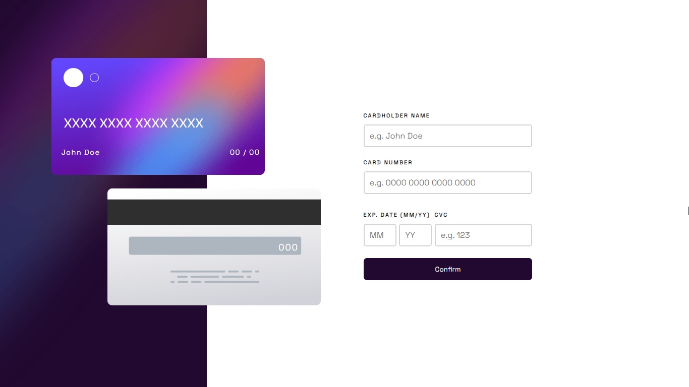

# Frontend Mentor - Interactive card details form solution

This is a solution to the [Interactive card details form challenge on Frontend Mentor](https://www.frontendmentor.io/challenges/interactive-card-details-form-XpS8cKZDWw). Frontend Mentor challenges help you improve your coding skills by building realistic projects. 

## Table of contents

- [Overview](#overview)
  - [The challenge](#the-challenge)
  - [Screenshot](#screenshot)
  - [Links](#links)
- [My process](#my-process)
  - [Built with](#built-with)
  - [What I learned](#what-i-learned)
  - [Continued development](#continued-development)
  - [Useful resources](#useful-resources)
- [Author](#author)
- [Acknowledgments](#acknowledgments)


## Overview

### The challenge

Users should be able to:

- Fill in the form and see the card details update in real-time
- Receive error messages when the form is submitted if:
  - Any input field is empty
  - The card number, expiry date, or CVC fields are in the wrong format
- View the optimal layout depending on their device's screen size
- See hover, active, and focus states for interactive elements on the page

### Screenshot



### Built with

- HTML5
- CSS
- Flexbox
- TypeScript
- Vite
- Zod (A TypeScript Validation Library)


### What I learned

I learned a bit about the Zod Library.

To see how you can add code snippets, see below:

```ts
function verifyValue(propertyName: string, valueToBeValidated: string) {
  return cardSchema[propertyName as keyof typeof cardSchema].safeParse(
    valueToBeValidated
  ).success
} 
// i feel good about this function
```

### Continued development

I think I'd like to learn more about responsive CSS because the CSS of this project took me about 3 days (mostly cause of procrastinating) and it's still not so responsive

## Author

- Frontend Mentor - [@Fexxix](https://www.frontendmentor.io/profile/Fexxix)

## Acknowledgments

- ChatGPT
- Myself
